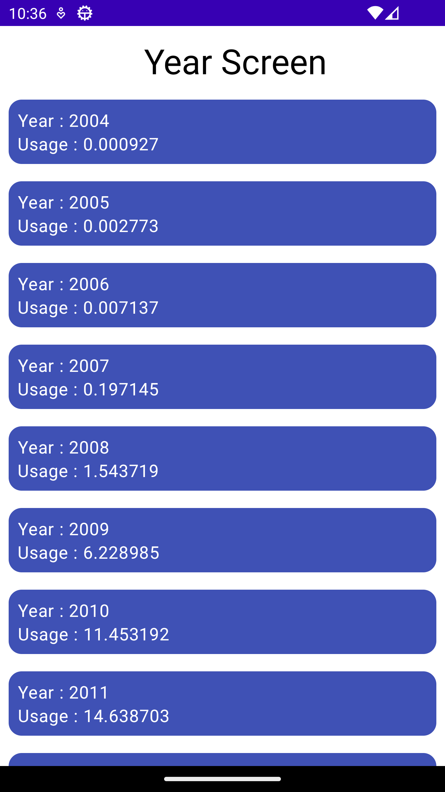
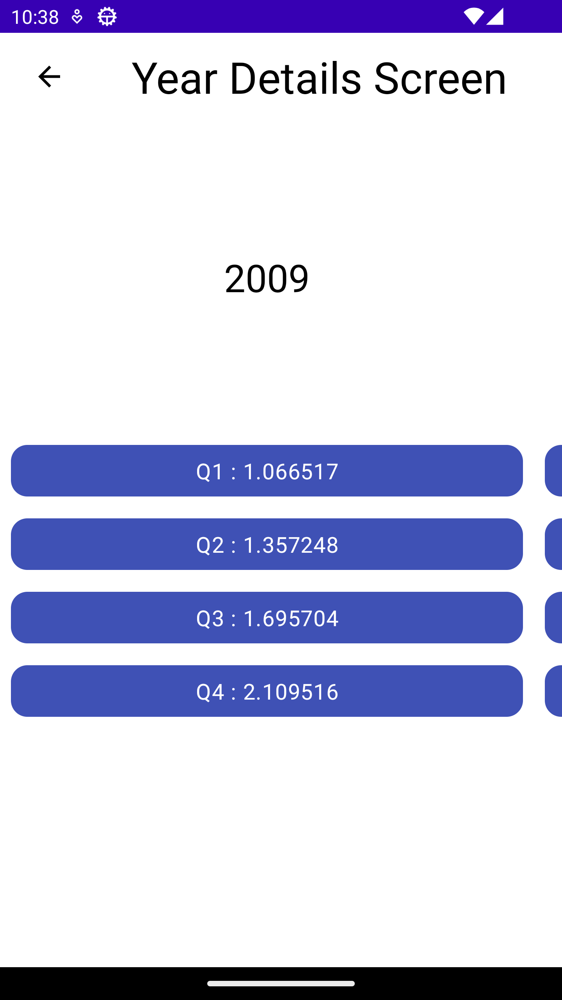

# Data-Usage
This app showcases the multi module architecture using Kotlin, Jetpack Compose and other technology stacks as listed below
to display mobile data usage across years and quarters.

## Technical Stack
- Multi module Architecture
- Jetpack Compose
- Kotlin
- MVVM architecture
- Room DB
- Retrofit
- Koin for Dependency Injection
- Kotlin flows
- Compose/UI testing
- Unit Testing with mokito

## Screens
### Year Screen

A Screen showing the total amount of data usage for each year.

### Year Details Screen (Quarter Screen)

A scree showing the amount of data usage for each quarter for a selected year.
It is possible to scroll left/right between different years

## Event Logging Mechanism

## Unit Testing (Instrumented Tests)

### features/consumption/years
### features/consumption/qtr
### core/repository
### core/data/datasource/local
### core/data/datasource/remote

## Compose UI testing (Emulator Tests)

### app 

