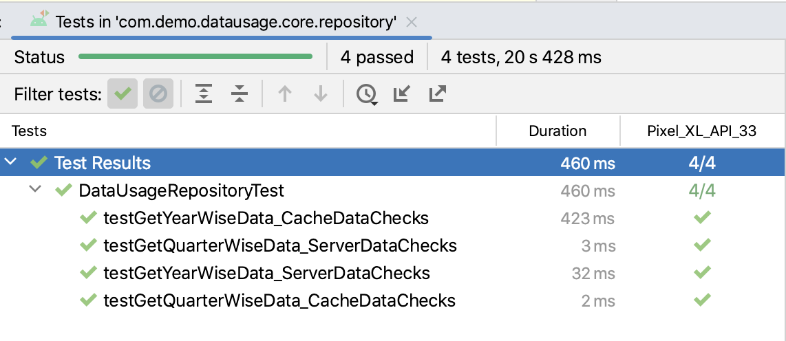
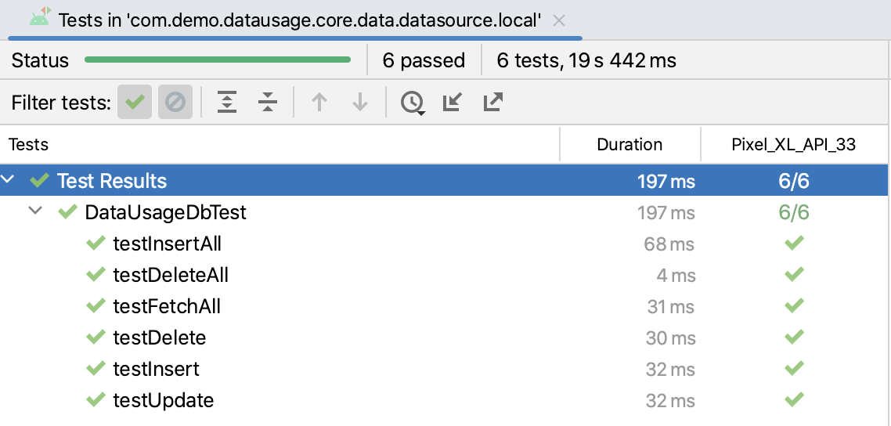
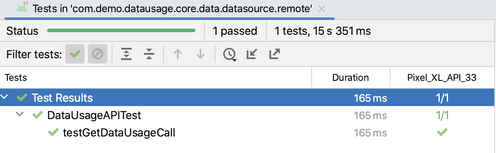
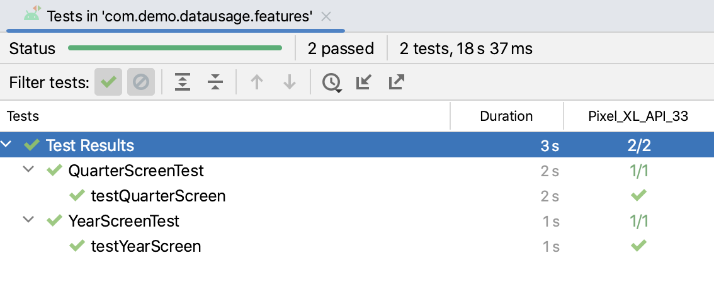

# Data-Usage
This app showcases the multi module architecture using Kotlin, Jetpack Compose and other technology stacks as listed below
to display mobile data usage across years and quarters.

## Technical Stack
- Multi module Architecture
- Jetpack Compose
- Kotlin
- MVVM architecture
- Room DB
- Retrofit
- Koin for Dependency Injection
- Kotlin flows
- Compose/UI testing
- Unit Testing with mokito

## Screens
### Year Screen

A Screen showing the total amount of data usage for each year.

### Year Details Screen (Quarter Screen)

A screen showing the amount of data usage for each quarter for a selected year. 
It is possible to scroll left/right between different years

## Data Caching Mechanism

- For the fresh application, data is needed from the server 
- Once data is fetched from server, the necessary data is stored in Local DB
- So, subsequently, data is first shown from existing DB and will show data even if there is no internet.
- But if internet is there, data from server will replace the existing DB data so that cache is as latest as possible

## Event Logging Mechanism

When a specific year's details is shown in UI. It is tracked in event logging. 
This is illustrated in below logs

## Unit Testing (Instrumented Tests)

### features/consumption/years

Tests written inside``src/androidTest/kotlin`` within ``:features:consumption:years`` module. 
Sample Test result below:

### features/consumption/qtr

Tests written inside``src/androidTest/kotlin`` within ``:features:consumption:qtr`` module. 
Sample Test result below:

### core/repository

Tests written inside``src/androidTest/kotlin`` within ``:core:repository`` module. 
Sample Test result below:

### core/data/datasource/local

Tests written inside``src/androidTest/kotlin`` within ``:core:data:datasource:local`` module. 
Sample Test result below:

### core/data/datasource/remote

Tests written inside``src/androidTest/kotlin`` within ``:core:data:datasource:remote`` module. 
Sample Test result below:

## Compose UI testing (Emulator Tests)

### app 
UI compose Tests written inside``src/androidTest/kotlin`` within ``app`` module. 
Sample Test result below:

